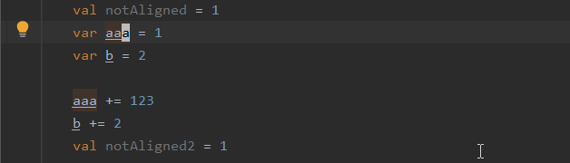

# intellij-smart-align

A IntelliJ plugin to provide better vertical alignment.
Align your code by assignment(`=`, `+=`, `-=`, `*=`, `/=`), colon(`:`) and comma(`,`). also support trailing comment.
You don't have to select what to be aligned, this plugin automatically figure it out.

## How to use

Place your cursor at where you want your code to be aligned, and invoke the Align command via `Code` -> `Smart Align` or Press `Alt + Shift + =`.<br/>
Then the code will be automatically aligned.

## Screenshots

### align around cursor

Detects and aligns lines that use the same symbol group from the line around the cursor.


### align selected text



### more examples

https://github.com/ttyniwa/intellij-smart-align/blob/master/src/test/kotlin/com/github/ttyniwa/intellij/plugin/align/AlignerSpek.kt

## Tips

Because `Reformat Code` and `Smart Align` conflicts, I recommend enabling formatter markers in comments via `Settings` -> `Editor` -> `Code Style` -> `Fromatter Control` -> `Enable formatter markers in comments`

```
// @formatter:off
write code here to be aligned.
// @formatter:on
```

## Contribute

* `gradle test`
* `gradle runIde`
* `gradle buildPlugin`

## Acknowledgements

Intellij-smart-align is heavily inspired by [Better Align for Visual Studio Code](https://marketplace.visualstudio.com/items?itemName=wwm.better-align)
