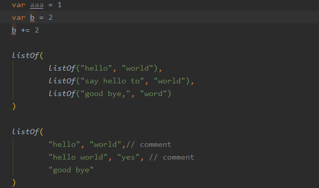

# intellij-smart-align

A IntelliJ plugin to provide better vertical alignment.
Align your code by assignment(=, +=, -=, *=, /=), colon(:) and comma(,). also support trailing comment.
You don't have to select what to be aligned, this plugin automatically figure it out.

## How to use

Place your cursor at where you want your code to be aligned, and invoke the Align command via Code -> 'Smart Align' or Press 'Alt + Shift + ='. 
Then the code will be automatically aligned.

## Screenshots

